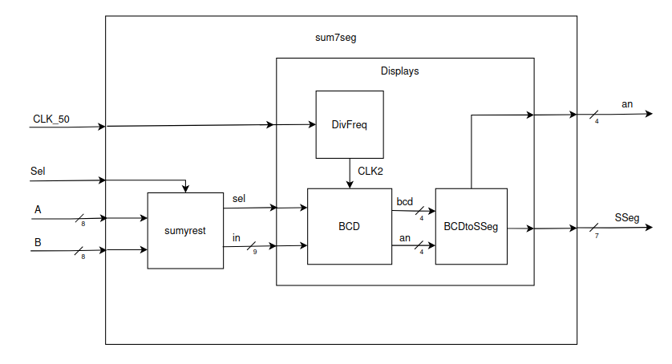

# Lab03: Decodificador BCD a 7segmentos

## Integrantes 

## Informe

Indice:

1. [Diseño implementado](#1-diseño-implementado)
2. [Simulaciones](#2-descripción)
3. [Implementación](#3-diagramas)
4. [Simulaciones](#4-simulaciones)
5. [Implementación](#5-implementación)
6. [Conclusiones](#conclusiones)

## 1. Diseño implementado

### 2. Descripción

### 3. Diagramas

  
   
  <em></em>

## 4. Simulaciones 

## 5. Implementación

  
   
  <em></em>

  
   
  <em></em>

  
   
  <em></em>

## Conclusiones

