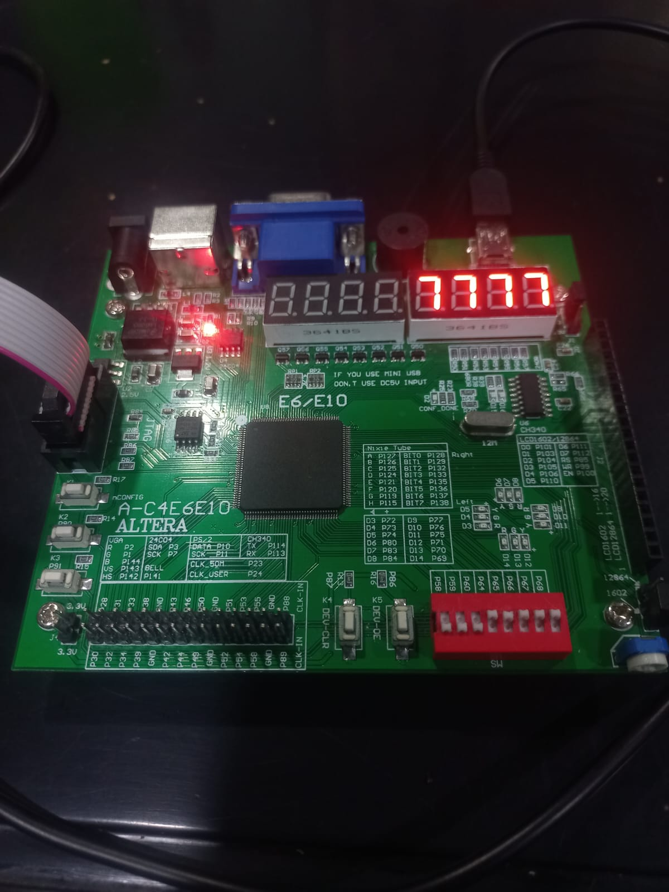
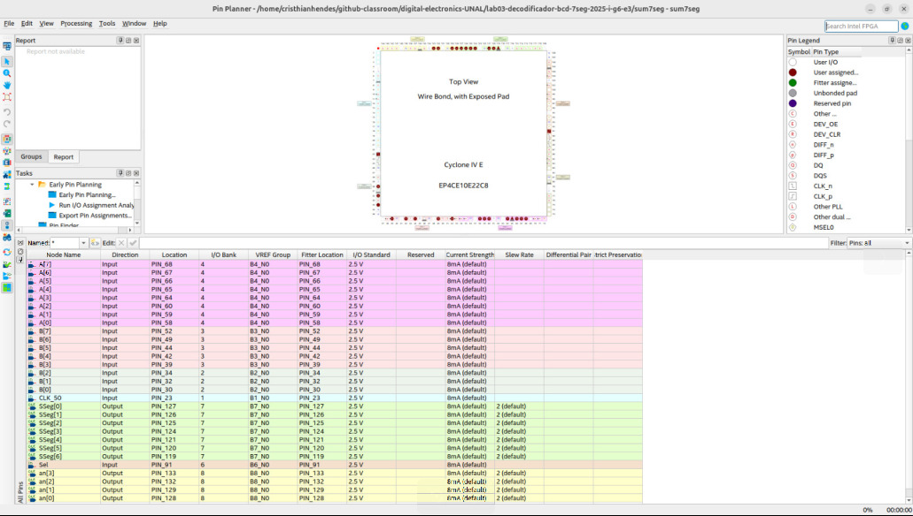

# Lab03: Decodificador BCD a 7segmentos

## Integrantes 
David Steven Pinzón Hernández

Gabriel Mauricio Estupiñan Parada

Laura Daniela Sarmiento Mendoza

Cristhian Steven Hendes Soraca

## Informe

Indice:

1. [Diseño implementado](#1-diseño-implementado)
2. [Simulaciones](#2-descripción)
3. [Implementación](#3-diagramas)
4. [Simulaciones](#4-simulaciones)
5. [Implementación](#5-implementación)
6. [Conclusiones](#conclusiones)

## 1. Diseño implementado

### - BCD a 7 seg
La práctica empieza con una introducción al diseño en HDL para un decodificador BCD en un display siete segmentos, el cual permite visualizar en formato decimal un número ingresado en formato binario de un tamaño de 4 bits para números del 0 al 9.

En el archivo verilog (el cual se encuentra adjunto) se declaran la totalidad de dos entradas y dos salidas. El conjunto de entradas se encargará por un lado de recibir los datos del arreglo del número de 4 bits que será decodificado a su número decimal y mostrado por el display. La otra entrada se encargará de activar o desactivar el display siete segmentos que se desea usar como monitor de salida, puesto que la tarjeta de desarrollo consta de dos módulos display de 4 siete segmentos cada uno (se usará una entrada de 4 bits que controle los cuatro 7 segmentos de uno de los módulos). Las salidas por un lado se asignarán a cada uno de los leds del siete segmentos, leds que representan una posición especifica en la matriz del siete segmentos "A,B,C,D,E,F,G". El led H se ignoró debido a que es innecesaria la presencia de un punto en la funcionalidad del decodificador. La otra entrada (arreglo de 4 bits) se asigna a los 4 respectivos siete segmentos que se desean usar, entiéndase al siete segmentos como el conjunto total de los leds mencionados con anterioridad.

El codigo consta además de un comando always que no depende del reloj, en el cual se encuentra un comando case que depende de la entrada del número en binario y que asigna a cada una de las posibles 10 entradas la activación correspondiente de los leds del siete segmentos que ilustrarían los respectivos números en decimal según una tabla de verdad para una configuración de ánodo común (leds se activan en estado bajo) . Se menciona que para el número "a" en hexadecimal el cual correspondería al 10 decimal se mostrará un cero en el siete segmentos y para cualquier otro caso posible de los 5 restantes el siete segmentos activará todos sus leds (simulando un 8).

### - Visualización Dinámica 4 Displays de 7 segmentos
A partir del siguiente diseño dado en la guia de laboratorio se creo el funcionamiento de la visualización dinamica, para este se propone la creación de un divisor de frecuencia a partir del cual se basa el funcionamiento de la visualización de los 7 segmentos, ya que como no podemos prender los displays en el mismo instante de tiempo, debemos crear una logica secuencial, a partir de la cual, se van mostrando los valores de decenas y unidades en el display necesario usando el modulo selector de anodo, de una manera lo suficietemente rapida para que a la vista no se vea este proceso, en el modelo BCD se creo una logica para extraer las unidades y las decenas de cada número mientras.
Finalmente se considero innecesario crear un modulo selector de anodo, sino que se integro con la logica del BCD, para que alterara el anodo que prenderia el siete segmentos necesario.

### - Sumador-restador

Finalmente se complementó esta práctica incluyendo la lógica vista en la práctica del sumador-restador, con la diferencia de que se modificó para que fuese de 8 bits. Para ello se utilizaron 8 sumadores de 1 bit.

Para poder unificar el sumador  junto a la visualización dinámica se creó un nuevo top denominado "sum7seg". En este nuevo top se unen los módulos de Display y sumyrest para poder mostrar la suma o la resta de dos números. En este top se crearon dos wire, uno de un bit y el otro de ocho para conectar los dos módulos ya que la salida del sumador-restador debe ingresar como una entrada al módulo de visulización (Display). Es importante hacer notar que como entrada al módulo Display se realizó una concatenación entre el resultado del módulo de sum y el acarreo, esto se realizó para poder manejar correctamente la resta en el módulo de Display.

## 2. Simulaciones (Descripción)

### - BCD a 7 seg 
Debido a que este archivo fue proporcionado por la docente como material ilustrativo no se hizo necesario la comprobación de su funcionamiento por medio de un banco de pruebas.
### - Visualización Dinámica 4 Displays de 7 segmentos
Para la simulación se utilizo un test bench en el cual se pudo ver el comportamiento de la logica del BCD, ante la entrada de ciertos números particulares.
### - Sumador restador
Para la simulación se usó un test bench en el que se evaluó un caso en particular. Aunque se requería evaluar varios casos se consideró mas conveniente dejarlo para evaluar caso a caso, cambiándolo manualmente. Como entradas del módulo se usaron cuatro registros, uno de los cuales se usó como señal de reloj, otros dos son los operandos de la suma y finalmente un selector que indica cuando hay una resta. Como salidas se colocaron dos "cables", uno para la selección del siete segmentos correspondiente y el otro para mandar el valor como tal.

## 3. Diagramas

### - BCD a 7 seg 
A continuación se muestra el diagrama del BCD a siete segmentos:

  

### - Visualización Dinámica 4 Displays de 7 segmentos:
A continuación se muestra el diagrama de la visualización Dinámica en siete segmentos:

  

### - Sumador restador

A continuación se muestra el diagrama del sumador-restador con salida a 7 segmentos: 

  

## 4. Simulaciones 

### - Sumador restador

En la siguiente imagen se muestra la simulación del sumador-restador unificado con la visulización en los siete segmentos, explicado con anterioridad. Aunque los módulos involucrados manejan mas elementos, en la simulación que se muestra solo se ven unos de ellos, los cuales dan información importante del funcionamiento en general. En primer lugar tenemos el valor del primer operando, seguido del segundo operando, ambos en formato hexadecimal. Luego se observa el estado de Sel, el cual indica si es suma o resta. Inmediatamente después se ve  CLK2, que es la señal de reloj tras pasar por el divisor de frecuencia. SSeg y an son las salidas de todo el módulo, y como se mencionó anteriormente son el selector de nodo y el valor que llega al siete segmentos en binario. Finalmente se muestra  bcd, el cual lleva el valor que entra a BCDtoSSeg desde el módulo BCD en cada ciclo de reloj.

  

## 5. Implementación

### - BCD a 7 seg 
Para hacer la respectiva implementación del diseño al hardware de la tarjeta de desarrollo de la fpga, se crea un new proyect wizard con nombre BCDtoSSeg en la carpeta del repositorio del laboratorio y al cual se le añade el archivo del diseño (.v), se declara a este último como el módulo o archivo top.

Paso siguiente se compila para comprobar el comportamiento y sintaxis del código. Una vez compilado con éxito se pasa al diseño del pin planner donde se escoge al dip switch de 8 terminales para que hagan la función de entradas, los pines (p58,p59,p60,p64) se encargan de leer el número en binario del bit menos significativo al más significativo, los pines (p65,p66,p67,p68) seleccionan que display siete segmentos se activa o desactiva. Las salidas se asignaron a los establecidos en la tabla de la tarjeta de desarrollo correspondiente a los módulos de los siete segmentos, (p127,p126,p125,p124,p121,p120,119) asignaban los leds (se ignoró el led del punto p115) y los pines que asignaban al siete segmentos como conjunto de leds fueron (p128,p129,p132,p133).

Despues de compilar el pin planner se envían datos a la FPGA y se verifica con éxito el funcionamiento del hardware, como se evidencia en la siguiente imagen para un par de ejemplos cualquiera.

  

  

Se destaca que no se presentaron inconvenientes con los puertos USB y el reconocimiento de la tarjeta.

### - Visualización Dinámica 4 Displays de 7 segmentos

Para la visualización dinamica el pinplanner se establecio de manera que tenemos 4 entradas a partir de los dip switch, las cuales nos daran el numero binario a convertir a decimal y tendremos 11 salidas, las cuales 4 seran para el selector de anodo y 7 para el envio de la información, para lograr una visualización optima de los números se probaron distintos valores en el divisor de frecuencia hasta que el ojo no detectase el cambio de anodo en la representación, y que pareciera que el número estaba todo el tiempo prendido, se puede ver en las imagenes de la siguiente sección ya que se basa en la visualización dinamica.

### - Sumador restador
Para la implementación de esta parte de la práctica se definió el pin planner necesario para su funcionamiento, considerando el uso de dos dip switch para los dos operandos de la suma/resta.

  

Como evidencia del funcionamiento de esta sección de la práctica se tomaron las siguientes imágenes: 

  

  

  

## Conclusiones

- Para implementar correctamente un decodificador BCD a siete segmentos, es fundamental conocer el tipo de display que se está utilizando (ánodo común en este caso), ya que esto define cómo deben activarse los LEDs (nivel bajo en vez de alto). Confundir esto puede llevar a resultados erróneos en la visualización. 
- Encontramos útil usar un 'case' dentro de un bloque 'always' para definir la lógica de activación de los segmentos, ya que esto permite organizar claramente las salidas correspondientes a cada número decimal.
- Uno de los principales retos al trabajar con múltiples displays fue manejar correctamente la multiplexación. Aprendimos que solo debe encenderse un display a la vez y que esto debe hacerse lo suficientemente rápido para que el ojo humano perciba una visualización continua. Si la velocidad no es la adecuada, los números parpadean o no se distinguen bien. 
- Para conectar correctamente los módulos (por ejemplo, el sumador-restador con el display), fue importante saber concatenar señales y convertir valores binarios con signo en su equivalente decimal visible. En particular, el manejo del complemento a 2 para mostrar números negativos fue un punto clave del laboratorio.
- A nivel práctico, el uso del 'pin planner' nos permitió identificar qué pines físicos asignar a cada entrada y salida, lo que es indispensable para que la implementación en la FPGA funcione correctamente. Olvidar declarar una entrada o salida puede hacer que el proyecto compile pero no haga nada.